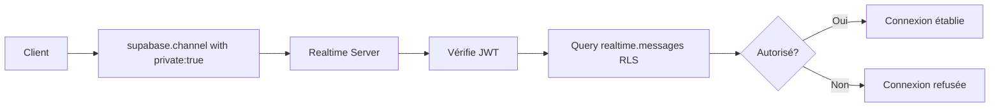

# Migration vers la Nouvelle Authorization Realtime de Supabase

## 🔄 Qu'est-ce qui a changé ?

Supabase a introduit une **nouvelle méthode d'authorization** pour Realtime en 2024-2025 qui utilise des **RLS policies sur la table `realtime.messages`** au lieu de la configuration basée sur la réplication.

### Ancienne méthode (❌ Deprecated)
```javascript
// Avant : Pas de contrôle d'accès, channels publics
const channel = supabase.channel(`project:${projectId}`);
```

### Nouvelle méthode (✅ Recommandée)
```javascript
// Après : Authorization via RLS policies
const channel = supabase.channel(`project:${projectId}`, {
    config: { private: true }  // Active l'authorization
});
```

---

## 📋 Changements Appliqués

### 1. Code JavaScript (`js/auth/collaboration.js`)

**Avant** :
```javascript
currentChannel = supabase.channel(`project:${projectId}`, {
    config: {
        presence: { key: user.id }
    }
});
```

**Après** :
```javascript
currentChannel = supabase.channel(`project:${projectId}`, {
    config: {
        presence: { key: user.id },
        private: true  // ⭐ NOUVEAU
    }
});
```

---

### 2. Base de Données (Nouvelles Policies)

**Ajout de RLS policies sur `realtime.messages`** :

```sql
-- Policy pour RECEVOIR les messages de présence
CREATE POLICY "Users can receive presence on their projects"
    ON realtime.messages
    FOR SELECT
    TO authenticated
    USING (
        realtime.topic() ~ '^project:[0-9a-f-]+$'
        AND EXISTS (
            SELECT 1 FROM public.project_members pm
            WHERE pm.project_id = (substring(realtime.topic() from 9))::uuid
            AND pm.user_id = auth.uid()
        )
        AND realtime.messages.extension = 'presence'
    );

-- Policy pour ENVOYER les messages de présence
CREATE POLICY "Users can send presence on their projects"
    ON realtime.messages
    FOR INSERT
    TO authenticated
    WITH CHECK (
        realtime.topic() ~ '^project:[0-9a-f-]+$'
        AND EXISTS (
            SELECT 1 FROM public.project_members pm
            WHERE pm.project_id = (substring(realtime.topic() from 9))::uuid
            AND pm.user_id = auth.uid()
        )
        AND realtime.messages.extension = 'presence'
    );
```

**Fonctions utilisées** :
- `realtime.topic()` : Retourne le nom du channel (ex: `project:abc-123`)
- `realtime.messages.extension` : Type de message (`presence`, `broadcast`, etc.)
- `substring(realtime.topic() from 9)` : Extrait l'UUID du topic

---

### 3. Configuration Dashboard

**Action requise** :
1. Va dans **Supabase Dashboard > Settings > Realtime**
2. **Désactive** "Allow public access"
3. Sauvegarde

⚠️ **Critique** : Sans cette désactivation, les policies RLS ne sont pas appliquées !

---

## 🎯 Avantages de la Nouvelle Méthode

### ✅ Sécurité Améliorée
- Contrôle granulaire par channel via RLS
- Seuls les membres autorisés peuvent rejoindre
- Protection au niveau de la base de données

### ✅ Flexibilité
- Policies personnalisables par projet
- Support de différents types de messages (presence, broadcast)
- Facile à étendre avec de nouveaux rôles

### ✅ Performance
- Cache des policies pendant la connexion
- Pas de requête DB pour chaque message
- Mise à jour automatique lors du refresh JWT

---

## 🔍 Comment ça Fonctionne

### Flux d'Authorization



### Vérification des Permissions

1. **Lors de la connexion** :
   - Client envoie JWT d'authentification
   - Realtime vérifie les policies RLS sur `realtime.messages`
   - Si autorisé → Connexion établie
   - Si refusé → Erreur de connexion

2. **Pendant la session** :
   - Permissions cachées pour la durée de la connexion
   - Mise à jour si nouveau JWT reçu
   - Déconnexion automatique à l'expiration du JWT

---

## 🐛 Troubleshooting

### Problème : Avatars ne s'affichent pas

**Cause possible** : "Allow public access" encore activé

**Solution** :
```bash
1. Dashboard > Settings > Realtime
2. Désactive "Allow public access"
3. Recharge la page de l'editor
```

### Problème : Erreur "Failed to subscribe to channel"

**Cause possible** : Policies RLS incorrectes ou manquantes

**Solution** :
```sql
-- Vérifie que les policies existent
SELECT * FROM pg_policies 
WHERE tablename = 'messages' 
AND schemaname = 'realtime';

-- Doit retourner 2 policies (SELECT et INSERT)
```

### Problème : "Permission denied" dans la console

**Cause possible** : L'utilisateur n'est pas membre du projet

**Solution** :
```sql
-- Vérifie l'appartenance au projet
SELECT * FROM public.project_members 
WHERE user_id = 'USER_UUID' 
AND project_id = 'PROJECT_UUID';

-- Si vide, ajoute l'utilisateur
INSERT INTO public.project_members (project_id, user_id, role)
VALUES ('PROJECT_UUID', 'USER_UUID', 'editor');
```

---

## 📚 Références

- [Documentation officielle Supabase Realtime Authorization](https://supabase.com/docs/guides/realtime/authorization)
- [Realtime Presence Guide](https://supabase.com/docs/guides/realtime/presence)
- [Row Level Security (RLS) Policies](https://supabase.com/docs/guides/auth/row-level-security)

---

## ✅ Checklist de Migration

- [x] Ajout `private: true` dans `collaboration.js`
- [x] Création policies RLS sur `realtime.messages`
- [x] Désactivation "Allow public access" dans Dashboard
- [x] Documentation mise à jour
- [ ] **À FAIRE** : Exécuter les scripts SQL dans ton Supabase
- [ ] **À FAIRE** : Désactiver l'accès public dans les settings
- [ ] **À FAIRE** : Tester la collaboration avec un second utilisateur

---

## 🎉 Résultat Final

Avec cette migration, ton système de collaboration est maintenant :
- 🔒 **Sécurisé** : Seuls les membres autorisés peuvent rejoindre
- 🚀 **Performant** : Policies cachées pendant la connexion
- 🎯 **Moderne** : Utilise la dernière version de l'API Realtime
- 📈 **Scalable** : Facile à étendre avec de nouveaux rôles

Tout est prêt pour la collaboration en temps réel ! 🚀
